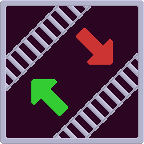

#  Source-Sink-Push-Pull   Opinionated Logistics Train Mod

A logistics train mod that aims to be as pleasant to use as possible, even when knee-deep in byproducts.

Check out the blueprint book (TODO) to get started.

## Networks

Every surface (planet) has an associated *network*. To open the network configuration window, click the Network button from any station or train. This is where you configure all of the items/fluids that SSPP will distribute. For each item/fluid, you must define a few things:
- Class: The name of the class of train that should deliver this item/fluid.
- Delivery Size: The amount of this item/fluid in one delivery. Larger values mean less congestion, but also larger buffers.
- Delivery Time: The maximum travel time from any depot to any provider to any requester. Larger values mean larger buffers.

Additionally, from this view you can see current demand and active deliveries for each item/fluid. Click the buttons to see the locations of assigned stations or trains.

## Classes

Within a network, you must define at least one *class* of train to make deliveries. A class represents a train layout where every train is interchangeable. For each class, you must define a few things:
- Name: The unique name used to identify this class. Used when assigning a train to this class.
- Depot Name: The name of the depot train stops to go to when not busy.
- Fueler Name: The name of the fueler train stops to go to when low on fuel. Required, but may be the same as the depot name.
- Bypass Depot (checkbox): When enabled, trains may be given new jobs before arriving at a depot. Disable if you are using double headed trains and getting "path broken" alerts.

Additionally, from this view you can see the number of available trains for each class. Click the button to see the locations of assigned trains.

To actually add a train to a class, click on the train that you wish to add. In the bottom right, you will see a new SSPP widget. Switch the train to manual, and then type the name of a class into the text box. Switch the train back to automatic, and the train will automatically head to the depot, ready for work.

## Stations

A *station* is, unsurprisingly, where cargo will actually be provided from or requested to. An SSPP station consists of 3 or 4 components:
- One **SSPP Train Stop**.
- One **General IO** combinator.
- One **Provide IO** or **Request IO** combinator, or both.

The combinators should all be placed within 2 tiles of the train stop. Once the components are all placed correctly, you can open the station configuration window by clicking on any of them.

From here, for each item/fluid you want to provide or request, you must define a few things:
- Source/Push or Sink/Pull: If set to push or pull, this station will be able to trigger new deliveries. Items/fluids from source stations will **never** be sent to sink stations.
- Throughput: The maximum rate of inflow or outflow of this item/fluid that this station should handle, per second.
- Latency: Extra time in seconds the station should support between deliveries. This accounts for load/unload time, congestion, etc.
- Granularity (provide only): The smallest amount of this item/fluid that can be loaded at a time. This is to prevent overfilling and items/fluids getting stuck.

Once configured, SSPP will then calculate the storage needed for each item/fluid, allowing you to verify that you have enough space to meet the desired throughputs.

You will need to plug in a few wires, but most setups won't need any extra logic:
1. Plug your storage (chests and/or tanks) into the input of the general combinator.
2. Plug your inserters/pumps into the output of the Provide or Request combinator, then configure them to set filters.

For those looking to do more advanced setups, the exact inputs/outputs of each combinator are as follows:
- General In: The contents of this station. Used to decide if new deliveries are needed.
- General Out: Nothing, but reserved for future utility information.
- Provide In: The contents of the stopped train. Connected automatically.
- Provide Out: The counts of all items/fluids that still need to be loaded.
- Request In: The contents of the stopped train. Connected automatically.
- Request Out: The counts of all items/fluids that still need to be unloaded.

## Depots and Fuelers

In SSPP, a *depot* or *fueler* is simply a vanilla train stop with the appropriate name. Depots **must** be configured with a train limit of one, as trains waiting behind others may still be tasked with new deliveries. Fuelers **must** be configured with no train limit, unless you have as many of them as you have trains, as SSPP expects a fueler to always be available.

## FAQ

TODO
